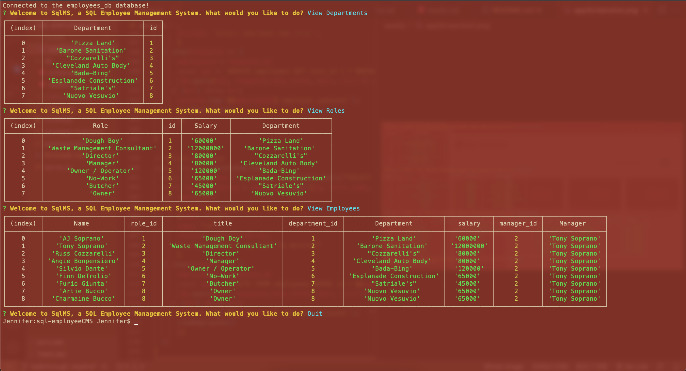

# sql-employeeCMS
## UCB Bootcamp Module 12 Homework Challenge
### Description
This is my submission for the UCB Bootcamp Module 12 Homework Challenge. 
This submission is a command-line application that allows users to manage a company's employee database. While this submission is written from scratch, the submission does follow a table schema outlined in the challenge instructions. This application uses Node.js, Inquirer, MySQL, and the console.table package. 
This submission includes a GitHub repository with application code with a walkthrough video and link to video demonstrating invoking the application from the command line. 

### Installation
Download the repository, install required packages, run database schema & seeds, and run program. Feel free to edit seed data as seen fit.

### Future Development
This app would benefit from the following functions:
* Update employee managers
* View employees by manager
* View employees by department
* Delete departments, roles, and employees
* View the total utilized budget of a department

### Screenshot of app

### Review
* Github repository: 
https://github.com/jmariemo/sql-employeeCMS
* Video walkthrough: 
https://drive.google.com/file/d/1YoySqW2Itv1x5AUSFl9KGXU1fL7Kh7Hc/view

